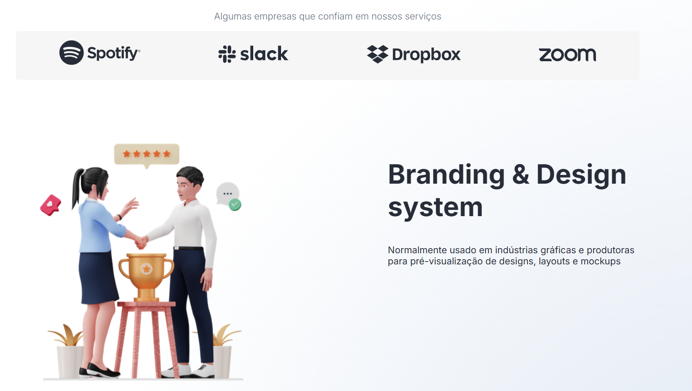
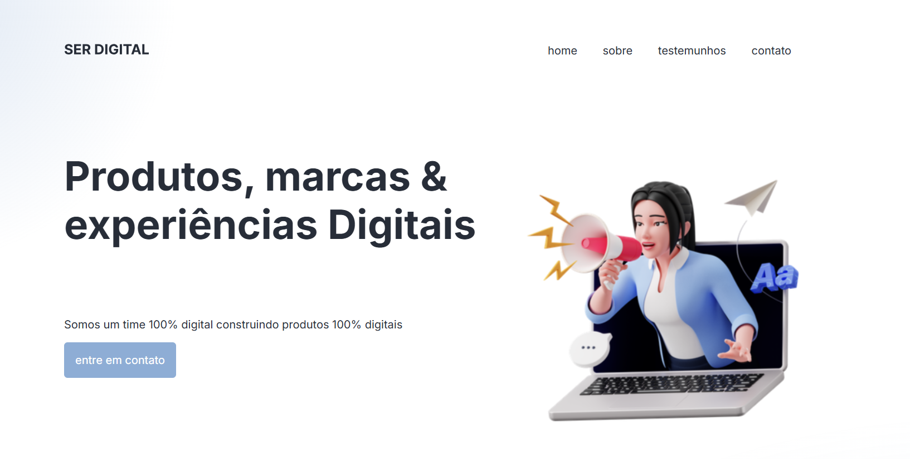
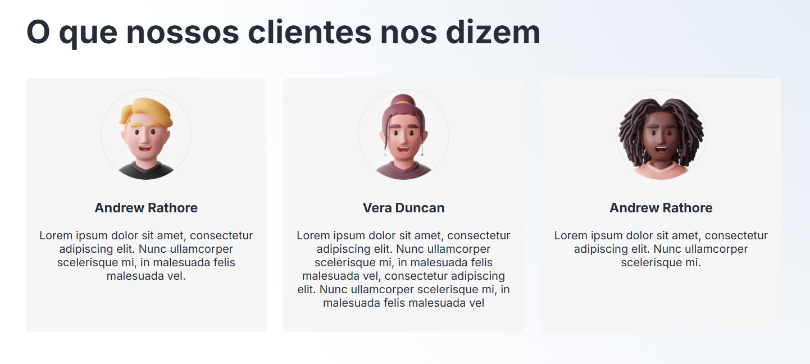

# 🧑🏽‍💻 Ser Digital


# en-US

A web platform focused on **digital web**, designed to deliver a simple, accessible, and responsive user experience.
The project simulates a website where users can see the company's partner brands and learn more about the company's purpose.

🔗 Live Demo: https://natanrbomfim.github.io/ser-digital/

## ✨ Preview

### 🖥️ Desktop







### 📱 Mobile


> Modern interface, responsive layout, and a strong focus on usability.

---

## 🚀 Features

- ✅ Responsive layout (mobile-first)
- ✅ Accessible navigation menu with ARIA
- ✅ Institutional section (“About us”)
- ✅ Best practices with semantic HTML

---

## 🛠️ Technologies Used

- HTML5 — Semantic structure
- CSS3 — Flexbox, Grid, CSS variables, and animations

---

## ♿ Accessibility

- The project was developed with accessibility in mind:
- Proper use of semantic HTML tags
- `aria-*` attributes for assistive navigation
- Focus states (`:focus`)
- Fully functional keyboard navigation

---

## 📱 Responsiveness

Compatible with:

- Smartphones
- Tablets
- Desktops

Adaptive layout without content breaking.

---

## 📂 Folder Structure
```text
📦 ser-digital
 ┣ 📂 assets
 ┃  ┗ 📂 imagens
 ┃     ┗📂 screenshot
 ┣ 📂 css
 ┃ ┗ style.css
 ┣ 📜 index.html
 ┗ 📜 README.md
```
---
▶️ Running Locally

Clone the repository:

```bash
git clone git@github.com:NatanRBomfim/ser-digital.git
```

Navigate to the project folder:

```bash
cd ser-digital
```

Open the index.html file in your browser.

---

👨‍💻 Author

Developed by Natan Bomfim

🔗 GitHub: https://github.com/NatanRBomfim

💼 LinkedIn: https://www.linkedin.com/in/natanbomfim/

---

# 🧑🏽‍💻 PetLar


# pt-BR

Plataforma web voltada para **setor digital**, com foco em uma experiência simples, acessível e responsiva.  
O projeto simula um site onde os usuários podem ver as marcas parceiras da empresa e aprender mais sobre o propósito da mesma.

🔗 **Deploy:** https://natanrbomfim.github.io/ser-digital/

---

## ✨ Preview

### 🖥️ Desktop


### 📱 Mobile


> Interface moderna, layout responsivo e foco em usabilidade.

---

## 🚀 Funcionalidades

- ✅ Layout responsivo (mobile-first)
- ✅ Menu acessível com ARIA
- ✅ Seção institucional (“Quem somos”)
- ✅ Boas práticas de HTML semântico

---

## 🛠️ Tecnologias utilizadas

- **HTML5** — Estrutura semântica
- **CSS3** — Flexbox, Grid, variáveis CSS e animações

---

## ♿ Acessibilidade

O projeto foi desenvolvido com foco em acessibilidade:

- Uso correto de tags semânticas
- Atributos `aria-*` para navegação assistiva
- Estados de foco (`:focus`)
- Navegação funcional via teclado

---

## 📱 Responsividade

Compatível com:

- Smartphones
- Tablets
- Desktops

Layout adaptável sem quebra de conteúdo.

---

## 📂 Estrutura de pastas

```text
📦 ser-digital
 ┣ 📂 assets
 ┃  ┗ 📂 imagens
 ┃     ┗📂 screenshot
 ┣ 📂 css
 ┃ ┗ style.css
 ┣ 📜 index.html
 ┗ 📜 README.md
```
---

# Como rodar localmente

Use:

```bash
git clone git@github.com:NatanRBomfim/ser-digital.git
```

Depois acesse a pasta do projeto:

```bash
cd ser-digital
```
Abra o arquivo index.html no navegador

---

# 👨‍💻 Autor

Desenvolvido por Natan Bomfim

🔗 GitHub: https://github.com/NatanRBomfim

💼 LinkedIn: https://www.linkedin.com/in/natanbomfim/